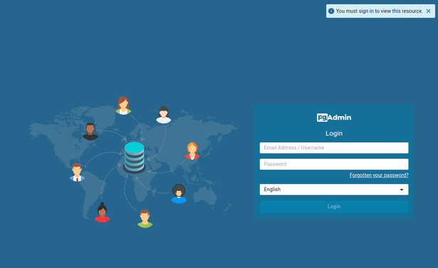
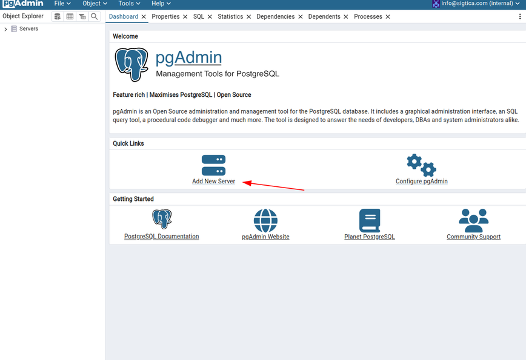
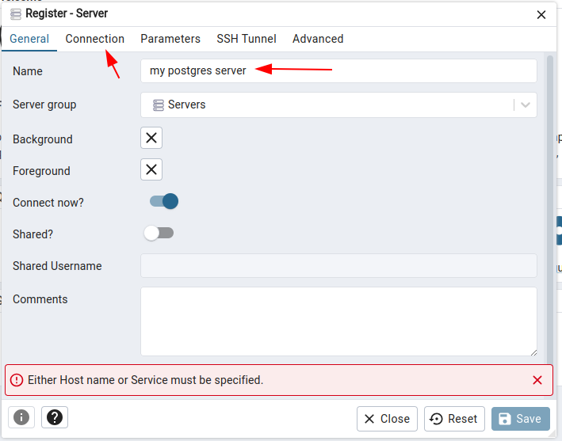
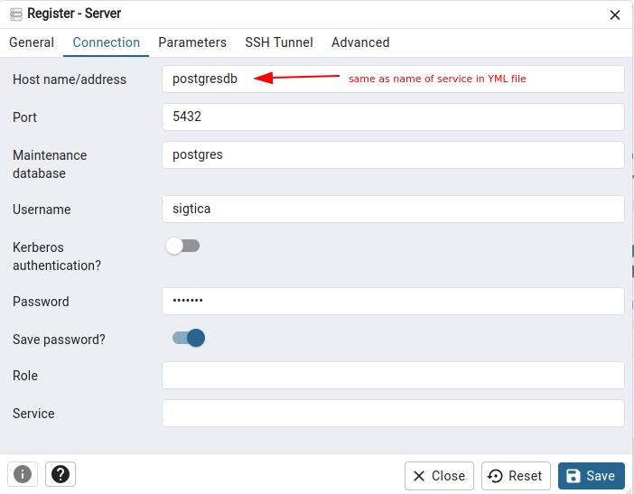
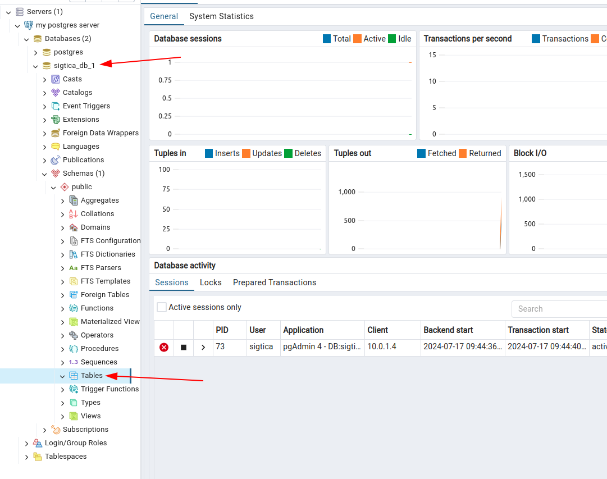

# Postgres Stack

This is a containerized Postgres instance with pgAdmin for easy development. The idea behind this repo is to make it really easy for quick deployment of a Postgres instance for data engineering and testing purposes. 

## Getting started

To get started, simply type this into shell:
```shell
bash start.sh
```
and the docker stack will spin up and pgAdmin should be available in the browser on port 8080 at your IP address. To find out what your IP address is, open terminal and type in `hostname -I`. Once you know what your IP address is, for example, `192.168.1.81`, then go to `http://192.168.1.81:8080` in your browser to view pgAdmin.

Once you access pgAdmin in the browser, you will need to manually add the database to pgAdmin. 

Step 1. Go to http://localhost:8080 (or your IP address) and login with your user email and pass that you defined in the YML file.




Step 2. Then "Add Server".




Step 3. Then name your server for pgAdmin and click on the 'Connection' tab.




Step 4. Under the connection tab, fill in the host name of the database. Since you are using a docker stack, the name of the service in the YML file is the host name of the database. The username and password are also the same as specified in the YML file. Then click 'save'.




Step 5. After everything has been set up, you can access the database on the side bar as follows:




## Stopping the stack

If you wish to spin down the stack, simply type this into shell:
```shell
bash stop.sh
```
and the docker stack will spin down within the next 10 seconds. To make sure that the stack is fully spun down, please check `docker service ls` and `docker container ls` to see if the containers or services are still on or not.


## Docker stack design

This docker stack is comprised of two services:
1. Postgres (named `postgresdb` in the stack)
2. pgAdmin (named `pgadmin` in the stack)

The Postgres service spins up a Postgres docker container complete with a root password, username and password, as well as global config files and persistent storage. It also has a setup script folder, which is for creating any tables in Postgres automatically upon booting up.

The pgAdmin service spins up a pgAdmin docker container and is exposed at port 8080. This means you can navigate to port 8080 on your own computer to view the site. Please note that this service is only available on HTTP and does not have SSL certificates (HTTPS not available), as this is only used for testing purposes.


## Support 

Please refer to the documentation by Docker on Docker Compose and how to use a YML file for spinning up Docker Stacks. 

For more information on Postgres (docker container version), please refer to their documentation: https://hub.docker.com/_/postgres.

For more information on pgAdmin (docker container version), please refer to their documentation: https://hub.docker.com/r/dpage/pgadmin4.


